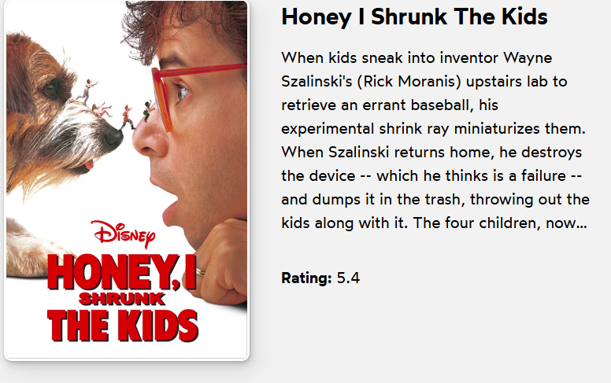
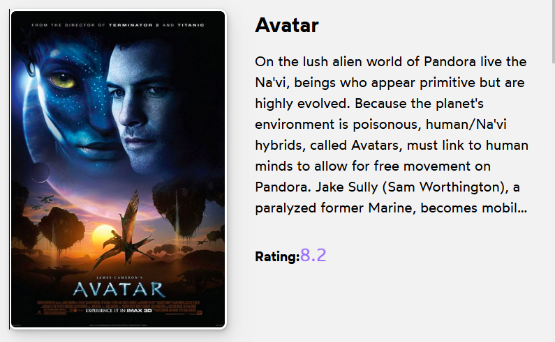
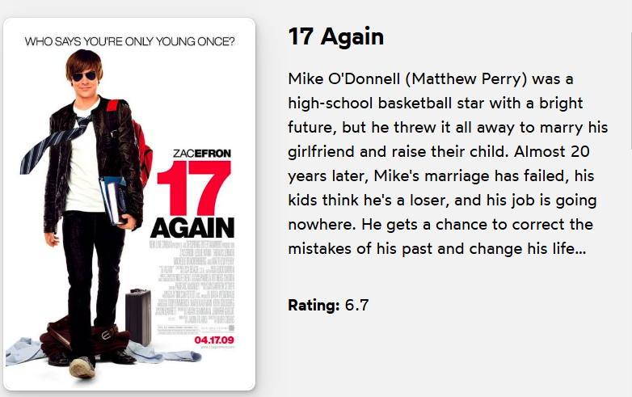
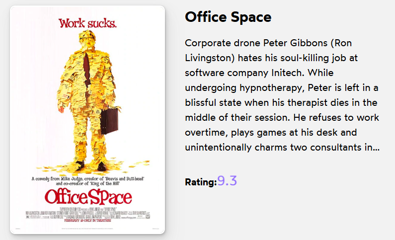

# Movie Ratings Animation to improve styling in React

## Overview
This project highlights movies with high ratings by applying a glowing effect to their rating numbers. The glowing effect is applied to movies that have a rating of 7.0 or higher, making them stand out visually.

## Features
- **Glow Animation**: Ratings of 7.0 or higher will have a glowing animation.

## project soursecode
Here codesandbox code
[Movie App on CodeSandbox](https://codesandbox.io/s/52lgj8?file=/Movie.js&utm_medium=sandpack)

## Project preview
The project should be like this in scroller

  
  
  
  

