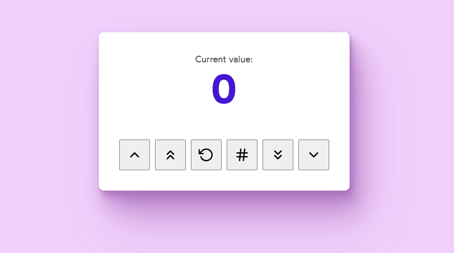

# Counter 2.0

The counter has been upgraded, and now supports several functions.

The buttons have already been added to the page, but they don't do anything yet. Your job is to wire up the buttons.

## Live Demo
Check out the live demo here: [ on CodeSandbox](https://codesandbox.io/s/vix62b?file=/Counter.js&utm_medium=sandpack)

## Acceptance Criteria:
- **⬆️** The button should increase the count by 1.
- **⬆️⬆️** The button should increase the count by 10.
- **🔄** The button should reset the count to 0.
- **#️⃣** The button should set the count to a random number between 1 and 100.
- **⬇️⬇️** The button should decrease the count by 10.
- **⬇️** The button should decrease the count by 1.

