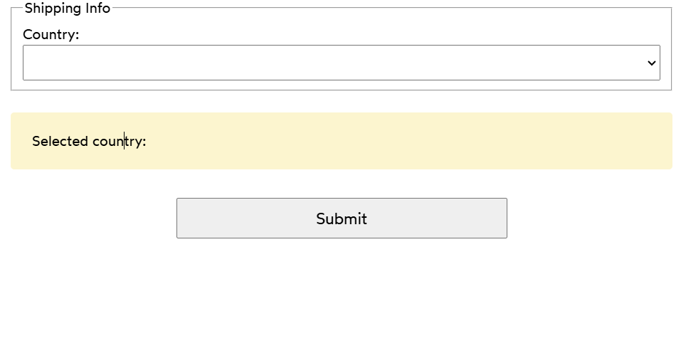

# Controlled Country Picker

- A simple React application for selecting a country from a dynamically generated `<select>` dropdown menu.

 - The “Big List O’ Countries” select is a staple of e-commerce sites. Let's build one!

 - Using the data provided in the COUNTRIES object, create a <select> tag with options for every country. Bind this <select> tag to the provided country state variable.
 
 ## Live Demo
 - Check out the Live demo in [codeSandbox](https://codesandbox.io/s/l44q8p?file=/App.js&utm_medium=sandpack)

 ➡ **Acceptance Criteria**  
- ✅ Use the `COUNTRIES` constant to dynamically generate the set of `<option>` elements.  
- ✅ Use `Object.keys()` or `Object.entries()` to iterate over the `COUNTRIES` object.  
- ✅ Include a "blank" option, selected by default, instead of defaulting to the first country in the list.  
- ✅ Display an updated indicator at the bottom when the selected country changes.  
- ✅ Ensure no warnings or errors appear in the developer console.  

## The Final Image 
