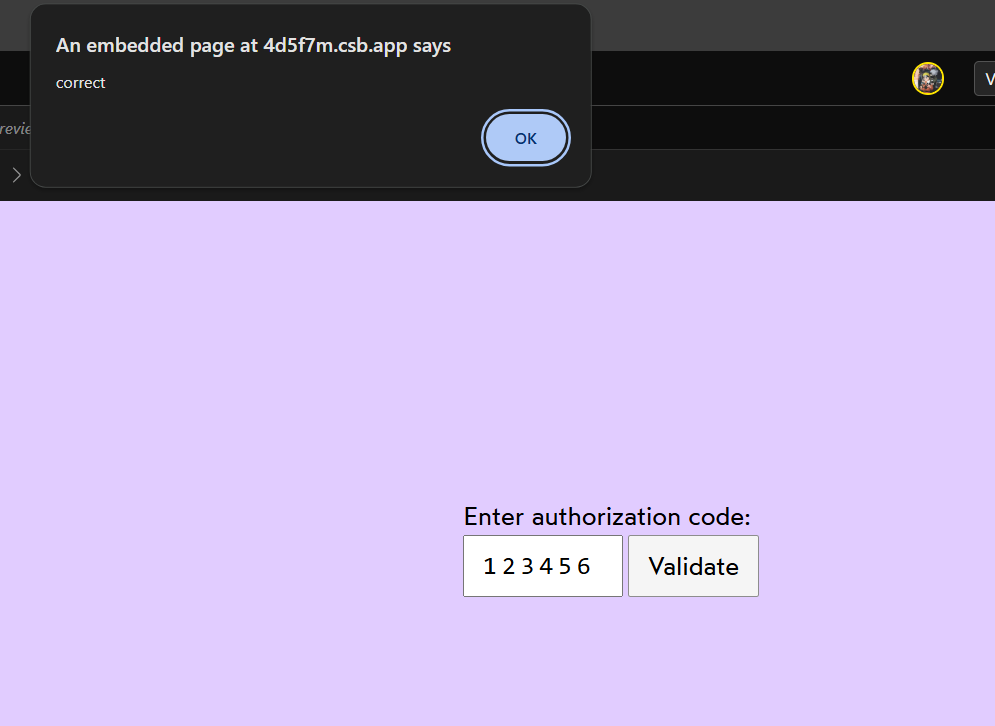

# Two Factor Authentication

- Two-factor authentication has quickly become a best practice in terms of securing logins for highly-sensitive accounts. The most common form I've seen is that the user is prompted to enter a short code, generated from an app

## Acceptance Criteria

1. The input's value should be held in React state.  
2. When the user submits their code, a `window.alert` should let them know whether it's correct or not, by comparing their submitted value with the `CORRECT_CODE` constant.  
3. A `<form>` tag should be used.  

## Live Demo

- Check out the Live demo here  [codesandBox](https://codesandbox.io/s/xin7u8?file=%2FApp.js&utm_medium=sandpack )

### Final Output should be like this 

