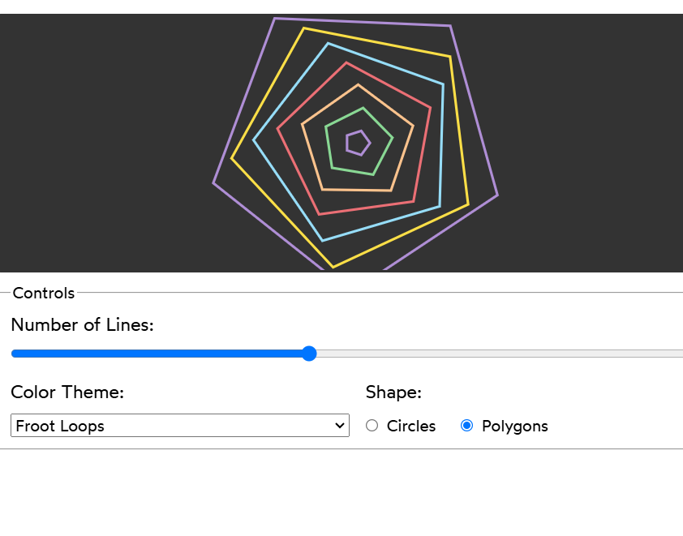

# Generative Art

- In this exercise, we're building a tool to produce generative art!

 - The tool is nearly complete, but the form controls need to be wired up. Your job is to connect the React state to the form controls, so that tweaking the controls will update the art.

  # Acceptance Criteria 

1. The range slider should be bound to the `numOfLines` state.  
2. The select control should be bound to the `colorTheme` state.  
3. The radio buttons should be bound to the `shape` state.  
4. The radio button labels should work correctly. The user should be able to click the text "Polygons" to select that option.  
5. The inputs should conform to HTML standards (e.g., radio buttons should be grouped using the `name` attribute).  
6. Note: Note: All of your changes should happen in `App.js`. The other files are shown in case you're curious how it works, but you can safely ignore them and focus exclusively on `App.js`.

## Live Demo 
Check out The Live deom on [codeSandbox](https://codesandbox.io/s/xp5bjn?file=%2FApp.js&utm_medium=sandpack )

## The Example of Final Image
- In the output, we can change to a circle or polygons, and we can also change the color and the number of lines."

