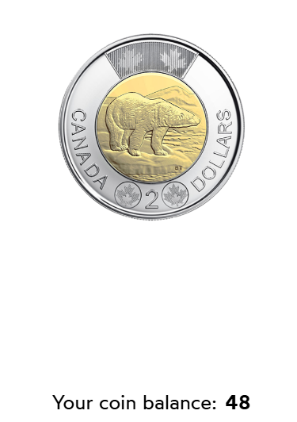

#  Lifting State Challanges

## Description 

1. “Your coin balance”, at the bottom of the page, should update to show the value of numOfCoins.
2. Clicking the coin should increment this value by 2 (since it's a $2 coin).

## Live Demo 
 
 - You can find the starter code in [codesandbox](https://codesandbox.io/s/fiupgu?file=%2FApp.js&utm_medium=sandpack)

 ## Final Image 
 

 

