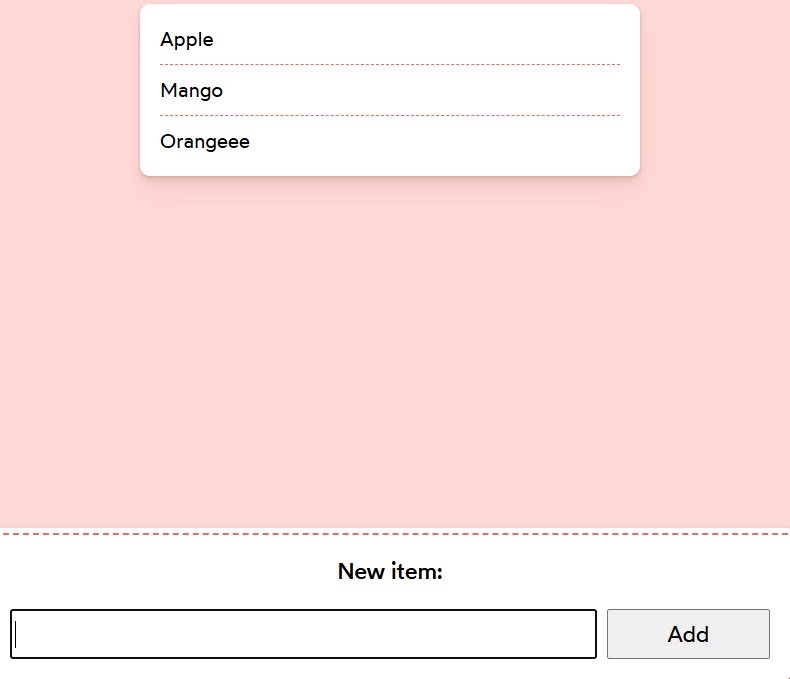

#  Add Items To Grocery List

## Description 

### Acceptance Criteria 
1. The shown list of items should be driven from React state. We can remove the placeholder foods, and start with an empty list
2. Submitting the form should add a new item to the list, and show it in the UI
3. When submitting the form, the text input should be reset, so that it's empty. This way, users can easily add multiple items without having to erase their previous entry.
4. There should be no “key” warnings in the console. Ideally, you shouldn't use the index for the key.

## Live Demo 

- you can find StarterCode in [codesandbox](https://codesandbox.io/s/mfc5dg?file=%2FApp.js&utm_medium=sandpack ) 

## Final Image 

