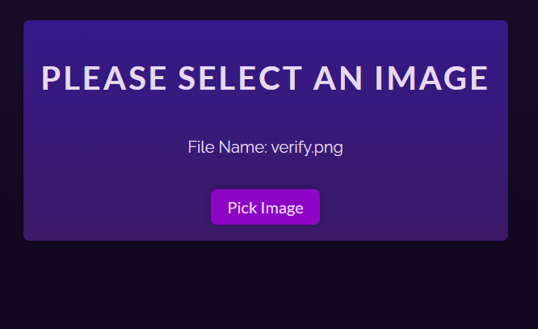

# Use Ref Challenge 

## Description 

- In this challenge, you are tasked with implementing functionality that triggers a file picker when a button is clicked. The file picker itself is hidden from the UI, but it should open when the "Pick Image" button is clicked.

 - You will achieve this using React’s useRef hook to access the hidden file input element and trigger the click event programmatically.

## Live Demo 

The starter code available on [codesandbox](https://codesandbox.io/p/sandbox/elastic-hofstadter-2mljyw)

## Instructions

  #### 1. UI Components:

- You will have a `<button>` element with the text "Pick Image".
- The file picker `<input type="file">` element is hidden using display: none in the CSS file. ( You need to add styling to the input tag and display: 'none')

 #### 2. Implementation Details

-  On the button's `onClick` event, call the `click()` method on the referenced file input element to simulate a file selection.
- use `state hook` to display whatever file you selected in the screen
- to display selected files we have a property `event.target.files[0]` this will give you the file and u know file have properties like `[name,size,width]` use the `file.name` to display name
- The file picker should remain `hidden`, and it should only open when the button is clicked.

## Finished Image 
- whatever file you selected it needs to display it on the scrreen(use State hook )

